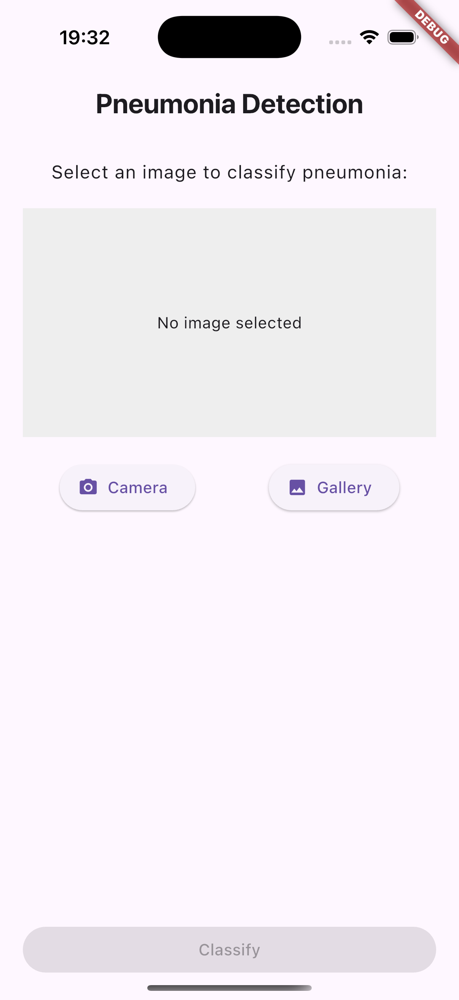
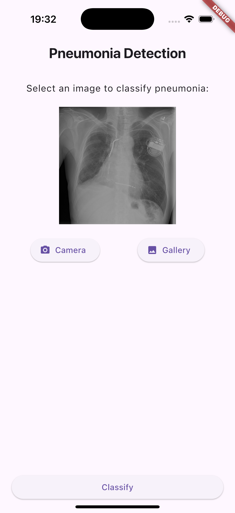
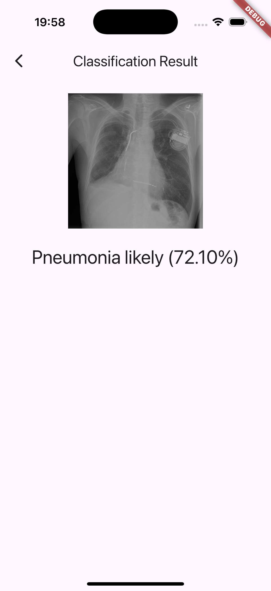

# Pneumonia AI App

The Pneumonia AI app is a sample application for the BiLD summer school. The aim of the app is to package the results of the image processing steps into a product that can be used to perform pneumonia detection based on x-ray images. As this is a Flutter project, we can run our app on multiple platforms, including mobile (iOS & Android), but also web, MacOS, and Windows.

This is a template repository for developing with [Flutter](https://flutter.dev/) on the web on [GitHub Codespaces](https://github.com/features/codespaces).

Flutter is a cross-platform UI framework by Google for building apps. Codespaces is a cloud-based development environment that lets you run a full-featured IDE in the cloud. This template repository lets you get started with Flutter on Codespaces in just a few clicks.

This repository is generated from the [dilanx/flutter-codespaces](https://github.com/dilanx/flutter-codespaces) repository and extended with a sample app for usage in the BiLD Summer School.

## Important things to note

Codespaces is not completely free. Free users have 120 core-hours per month and Pro users have 180 core-hours per month. The default codespace runs on a 2-core machine, so that's 60 hours (or 90 hours) of free usage per month before getting charged. Make sure to stop your codespace when you're not using it (it automatically stops after 30 minutes of inactivity by default). See more pricing details [here](https://docs.github.com/en/billing/managing-billing-for-github-codespaces/about-billing-for-github-codespaces), and manage your active codespaces [here](https://github.com/codespaces).

## Setup

### Getting started

1. Press "Use this template" towards the top right of this repository and create a new repository from this template.

    > There's also an option to open this repository in Codespaces and publish it to GitHub later from there, but I recommend creating your own repository first.

2. In your new repository, press "Code", select "Codespaces", then press "Create codespace on main". A container with everything you need to get started will be created automatically, then you'll be taken to your new codespace (VS Code in your browser). If you'd prefer to work on your codespace using the VS Code desktop app instead of the browser app, you can follow these instructions.

3. Press the "Extensions" icon in the left sidebar. You'll see that the Flutter and Dart extensions are already being installed. The environment won't work properly until the installation is complete, so wait for it to finish.

4. In your integrated terminal (the TERMINAL tab), run `flutter pub get` to install the missing Flutter dependencies.

5. In the ports view (the PORTS tab), port 3000 should be listed there already. Right click on it, and, under "Port Visibility", select "Public". This is important so the app can access services on your client from other server ports without getting blocked due to CORS.

6. Run `./run.sh` in the terminal to start the app. A notification will appear saying that an app opened on port 3000. You can press "Open in Browser" to open it, but it won't load until the terminal shows that it's ready. You can refresh once the app is loaded (as indicated by a prompt to press "R" to reload).

    > You can find the link to access the app in your browser at any time by going to the ports view, right clicking on port 3000, and pressing "Open in Browser".

7. That's it! Make changes in `lib/main.dart`, press "R" in the terminal, then refresh the page to see your changes appear quickly.

8. (Advanced) If you want to, you can checkout the app and run it locally. There, you can actually run the inference model from the previous workshops in the iOS/Android simulator or even deploy to your own device. Setup Flutter on your computer following [Flutter's setup guide](https://docs.flutter.dev/get-started/install). 

A few additional resources to get you started if this is your first Flutter project:

- [Lab: Write your first Flutter app](https://docs.flutter.dev/get-started/codelab)
- [Cookbook: Useful Flutter samples](https://docs.flutter.dev/cookbook)

For help getting started with Flutter development, view the
[online documentation](https://docs.flutter.dev/), which offers tutorials,
samples, guidance on mobile development, and a full API reference.

## Codespaces Usage

### Managing your codespace

When you're not using your codespace, deactivate it by going to [Codespaces](https://github.com/codespaces), pressing the 3 dots on the right side of the codespace, and pressing "Stop codespace". You can also deactivate it within the codespace by pressing "Codespaces" at the bottom left of VS Code and selecting "Stop Current Codespace".

Edited files in your workspace are not deleted when stopping the codespace and the container won't need to be rebuilt when you start it again. Provided that you're under the storage limit (15 GB for Free users and 20 GB for Pro), you won't be charged if your codespace is offline. I recommend committing your repository changes on your codespace often to avoid losing work if you were to delete your codespace.

## Project Structure

This repository has several folders on the top level, of which most of them do not need to be touched for this exercise. They contain the auto-generated, platform-specific code for our different targets. For our session, we need the following folders/files:

- lib
    - screens
        - home_screen.dart # Contains the home view of our app
        - results_screen.dart # Contains the view that handles displaying the results of our classification
    - services
        - classifier.dart # Handles in- and output of the classification task - in our case, through tflite_service.dart
        - tflite_service.dart # Handles model loading and data processing related to our tflite model for classification
    - widgets
        - image_preview.dart # Handles displaying our x-ray images
    main.dart # The entry point into our app
pubspec.yaml # Handles configurations of our app, including additional Flutter packages that we might need

Feel free to also explore the other files, but please do not modify them ;)

## Our Tasks 

  

In its initial state, this repository contains a rough app structure. During the session, we will extend the app with the following features:

1. Display a basic UI:
We will add new UI elements to our still empty-looking app: AppBar, Image upload area, Classification Button.

2. Add Image Picker (Plugins & Async):
We will implement a function to let users upload images from their gallery and show it in our UI.

3. Add a second screen for the classification result
We will add navigation to a second screen, that we will then use to show the X-ray image and our classification result. On returning to the home screen, the home screen should be reset to be prepared for the next classification.

4. Run the classification on-device:
We will use the tflite_service to run our selected image through the pneumonia that was previously created in the classification session (densenet121). To enable compatibility with flutter, we converted the trained model into .tflite format. In the web, this does not work due to missing tflite support. There, we use a mock service to return the same results as we would get through the real model. 

5. Display the classification result:
We will display the result in our result_screen, including the probability and the result (Pneumonia likely/unlikely).

Optional tasks:
- (Easy) Add a loading indicator while inference runs (CircularProgressIndicator)
- (Easy) Highlight confidence thresholds visually (color coding)
- (Easy) Cutomize the app theme to give your app a unique appearance (see Theme definition in main.dart)
- (Advanced) Store image + result history in local storage
- (Advanced) Add go_router navigation to a history/details page
- (Hard) Retrain Pneumonia Detection on a tflite-compatible model and add it into the app. You can also draw bounding boxes.

- ... come up with other helpful features ;) 